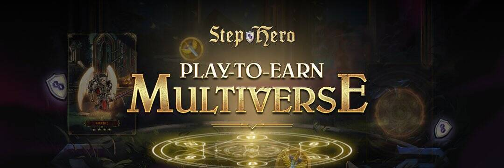

# Gunfire Hero

什么是枪火英雄？
Gunfire Hero是一款战斗射击游戏，具有自动射击玩法，玩家只需要控制角色的移动，射击完全自动，怪物无处可藏。
在Gunfire Hero中，玩家将扮演拥有强大步枪的英雄角色。 你的任务是通过收集游戏内物品、赚取代币和升级你的英雄/装备来对抗邪恶的怪物，同时增强能量。 每次挑战后的怪物会变得更危险、更拥挤、更强大。 如果你的英雄/装备不能升级，对人类来说将是一个巨大的危险。
枪火英雄玩家可以通过以下几种方式获利：
一旦他们赢得无尽模式/每周活动/每个阶段，他们就可以获得奖励。
他们可以升级游戏内物品的稀有度，并在市场上以更高的价格出售。
他们可以升级他们的角色并在以后进行交易。

