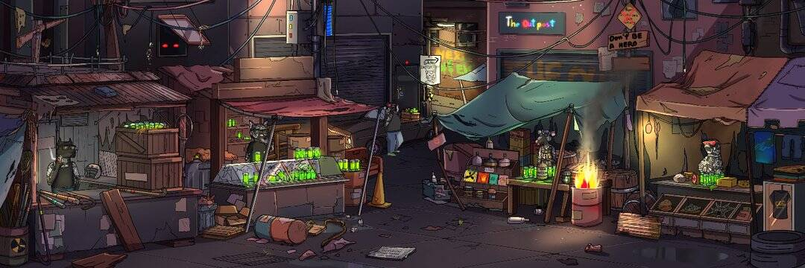

# Gutter Cat Gang

这一年是 2050 年。人类是一个星际物种，几乎已经放弃了地球上世界末日后的社会碎片。 猫已经接管了。 一个犯罪猖獗、不起眼的内城居住着一群猫，统称为“阴沟猫”。 这是他们的故事。
什么是地沟猫帮？ Gutter Cat Gang 是 3000 个独特的 Gutter Cat NFT 的集合，他们生活在 ETH 区块链上的后世界末日社会的破碎中。 所有权包括您的 Gutter Cat 的创意和商业权利以及加入帮派的权利。

欢迎来到 Gutter，这是一个地下 web3 社交俱乐部，您的 NFT 兼作 Gutter Cat Gang 的会员代币。

Gutter Rats、Pigeons 和 Dogs 代表 Gang 的基础级别成员，Gutter Cats 代表 Gang 的首要成员级别，并且每个 Gutter NFT 解锁不同且独特级别的社区主导访问和特权。

