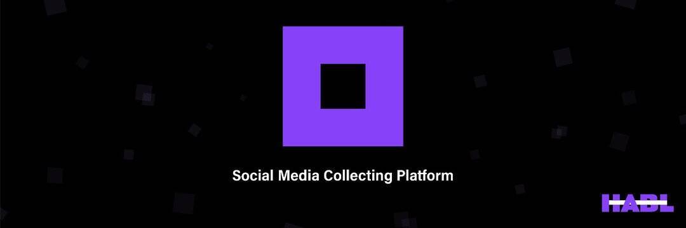

# HABL

“hiblocks”是一个基于区块链的社交媒体管理平台，通过代币化奖励用户以促进社区参与。 任何人都可以轻松地与现有的社交媒体帐户集成以策划内容并产生收入。

如何加入：
1.加入#MEXC全球交易所。
2. 购买#HIBS。

3. 转到“资产”并单击 HIBS 以屏幕捕获 HIBS 资产状态。

4. 填写表格 http://bit.ly/AIRDROPHABL。 上传屏幕截图并在 MEXC 上输入您的#HIBS 地址以接收空投。 

   关于 MEXC Global
   MEXC 是一家成立于 2018 年的全球性交易所。作为金融和区块链技术的先驱之一，MEXC Global 现在为全球 70 多个国家的超过 600 万用户提供服务，并继续扩大其服务范围。 HIBS团队坚信通过区块链技术增加价值，连接人与人，创造美好未来的原则。因此，我们很高兴能够通过 MEXC Global 实现更多里程碑并接触更广泛的受众，而我们才刚刚开始。

   除了 MEXC Global，HIBS 还可以在 Indodax（印度尼西亚）、Bithumb、Coinone Korea 和 Klayswap 获得。此外，我们正在积极准备在其他顶级全球CEX和DEX平台上上市HIBS，以将我们的服务扩展到国际社会。

