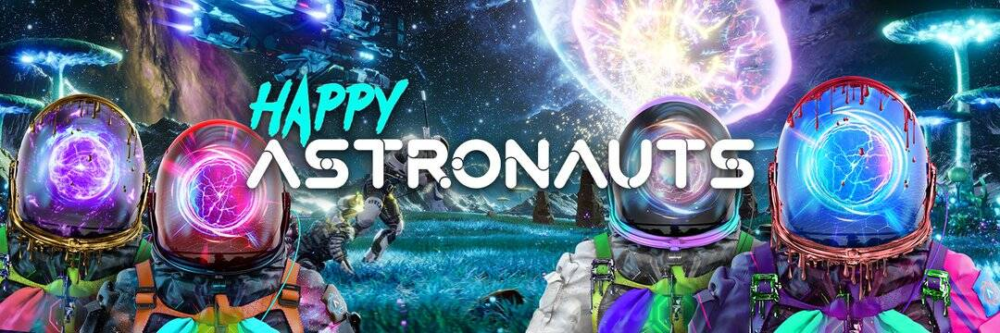

# Happy Astronauts

Happy Astronauts 是由 10,000 个算法生成的独特数字收藏品的集合，这些收藏品生活在以太坊区块链上。 我们正在虚幻引擎 5 上开发视觉上令人惊叹的开放世界元宇宙，您将能够在游戏中解锁您的宇航员以及拥有 OG 宇航员的其他额外独家功能。 所有游戏内购买都将是元节中存在的 NFT。 游戏将有多种游戏模式，包括冒险、创意、合作和皇家战斗。
我们还在开发系统以将 NFT 和 Crypto 完全集成到现有的游戏引擎以及 API 中，以供新的和即将推出的游戏和引擎使用。 此外，我们将在 2022 年推出一个名为 Zolodia 的完整元界生态系统
穿上衣服，系好安全带，准备好和我们一起踏上这段旅程吧！

