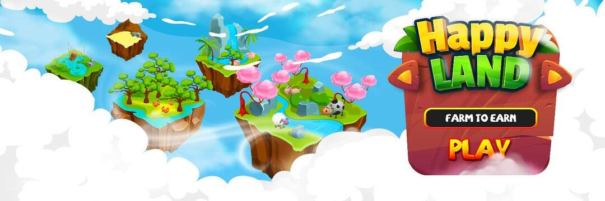

# HappyLand

FarmVille 于 2009 年成为 Facebook 上最受欢迎的游戏，并保持该位置超过两年。在 2010 年 3 月的鼎盛时期，该游戏的月活跃用户数超过 8000 万，日活跃用户数达到 3450 万。 HappyLand 建立在这个经过验证的游戏概念之上，围绕农田管理的各个方面展开，例如耕地、种植、种植、收割庄稼和树木以及饲养牲畜。农业和城市系统包括购物中心、娱乐场所等。将钱包连接到平台后，玩家最初会从农舍和仓库开始。他们可以购买不同稀有度和不同生产力水平的额外农田。随着玩家购买更多土地，他们还可以购买更多种子来种植更多植物，然后可以将其出售以获得更多经验和代币。最重要的是，玩家可以在技术实验室开发自己的种子，让每个玩家都能发挥创造力并制定独特的耕作策略。在某个阶段，农民可以解锁工厂并在他们的农业中实施机械。
在 HappyLand 的 P2E 模式中，玩家只需少量投资，即可拥有几乎无限的盈利潜力。玩家最初需要购买 HappyLand 的原生代币 $HPL 来获取土地、农作物和动物。通过参与游戏内经济，玩家反过来获得 $HPL 奖励。此外，现有的加密农场游戏并未在其游戏中加入角色，这将允许用户通过独特的角色风格和商品来个性化他们的游戏体验。

