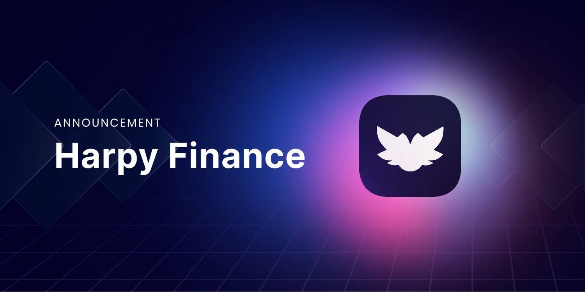

# Harpy Finance

什么是 Harpy Finance (HARPY)？
Harpy Finance 是一套适用于以太坊第 2 层 (Arbitrum) 的 DeFi 产品。单产农业，借贷，借贷。所有这些都在一个分散的、社区驱动的平台上。
HARPY 是用于：

  在 Yield Farms 中使用它来赚取更多 $HARPY。
  将其投入单池以赚取免费代币。
  参与 POD（彩票系统）-（将在第 3 阶段/第 4 阶段实施）。
  对与 HarpyFinance 生态系统相关的提案进行投票。治理仍将在第一阶段实施。一旦实施，所有项目决策都将转移到 HARPY 利益相关者手中。此外，治理将控制与项目资金相关的决策（占总供应量的 15% ~487,500 HARPY）。

HARPY 代币如何分配？
一般来说，它计划铸造 3,250,000 HARPY，在 16 个月内分发。 * 社区分布：70%（~2,275,000 HARPY）——第一阶段：50%，第二阶段：25%，第三阶段：12.5%，第四阶段：6.25%。 * 国库：10%（325,000 HARPY）——在第 2 阶段开始时铸造并由治理控制。 * 启动后流动性激励：15%（487,000 HARPY）——由治理投票，但最初保留用于各种流动性激励和合作伙伴关系。 * ICO：3%（97,500 HARPY）。 * 团队代币：2%（65,000 HARPY — 25% 在每个阶段开始时铸造，并在初始铸造仪式后锁定 4 个月。每季度的最后一个月释放）。由多重签名钱包控制。

