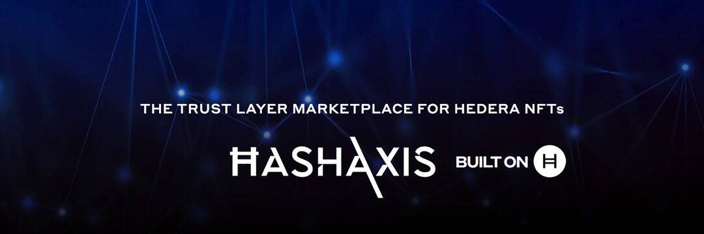

# Hash Axis

HashAxis 使用 Hedera 实现快速、可扩展和低成本的 NFT 原生 NFT 版税用于二级销售 可扩展的代币转移（10,000 tps）
HashAxis 利用 Hedera 代币服务——结合 Hedera 上的原生原子交换和版税功能——来铸造、管理和交易 NFT。 Hedera 的低且可预测的费用、快速的性能和碳负交易支持平台上艺术家和 NFT 项目等的采用、保留和使用。
HashAxis 利用 Hedera 的原生 NFT 版税功能，使 NFT 创建者可以轻松地将版税合并到代币中。这可以确保向创建者支付任何将加密货币换成 NFT 的二次销售。 Hedera 的原生版税避免了复杂智能合约的配置，并更有效地执行这种复杂的操作。
Hedera 代币服务的基准指向 Hedera 主网上的代币传输性能估计为每秒 9,997 次传输（10k TPS 的节流）和 2 - 3 秒的结算时间，交易最终确定。这种级别的可扩展性确保 HashAxis 市场上 NFT 的发送者和接收者都体验到最快的结算时间并且不会出现网络拥塞。

