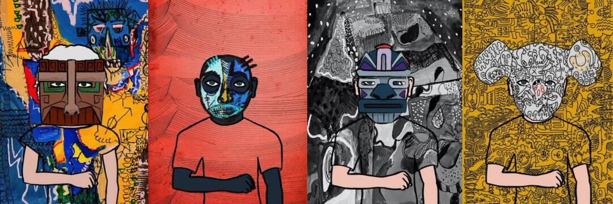

# Hashmasks

下一代数字艺术收藏品
Hashmasks 引入了数字艺术和收藏品的组合，其价值层次由艺术品的创造者和消费者共同决定。 与其他收藏品不同，所有特征的稀有性都由创作者设定，Hashmasks 包含两层稀缺性：它提供了一组特征来为消费者提供一般指导，但它也创造了许多隐含的特征，没有考虑到 . 最重要的是，对所有特征中最稀有的特征——名称——的控制权完全交给了消费者。Hashmask 9556 最近进行了一系列名称更改-从底线开始并向后工作以形成链上声明-在顶部以新名称/标题结束-“Mister Doodle”
他是项目贡献者吗？ 无所谓——艺术不能被艺术家所超越

