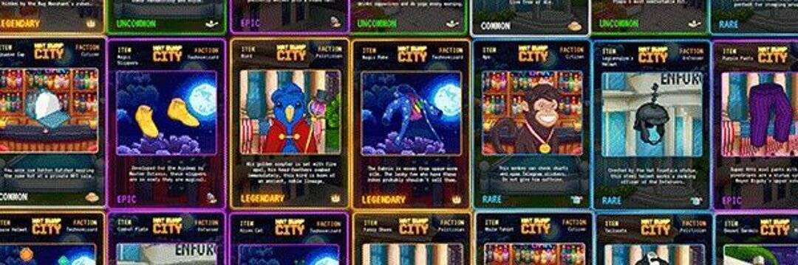

# Hat Swap City

Hat Swap City 是世界上第一个存在于社交 MMO 中的沉浸式 NFT 市场。 探索未来像素元宇宙，通过我们的迷你游戏赚取代币和 NFT，并与您的朋友聊天。 Hat Swap City 以 Binance Smart Chain 合作伙伴项目为特色，作为向链添加实用程序的一种方式，让你看到你最喜欢的 NFT 变得栩栩如生。 这一年是 2042 年。Nicholas Dusk 向火星发射了一支宇宙飞船。 每艘船都承载着 10,000 人的微型社会。 在一艘船上，最奇怪和最危险的社会将自己命名为 HAT SWAP CITY。 在旅程结束时被选为市长的人将被加冕为火星之王。

