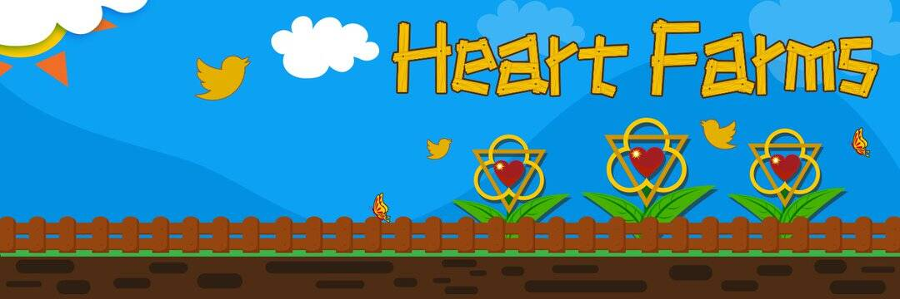

# Heart Farms

Heart Farms 是一款可通过网络玩的区块链游戏和虚拟土地管理系统。
Heart Farms 的预期寿命为数十年，为普通人提供了一个在充满希望、欢乐和机会的虚拟世界中播种、培育和成长的机会。👨‍🌾农民们好！ #Telos
为下一次土地拍卖做好准备，接下来的几天在 Heart Farms 将非常令人兴奋

我们的产品
作为一个自给自足的农场，我们收获和加工我们自己的牲畜，将皮革晒黑并晒干骨头以获得骨粉和工具。我们希望每个人都能获得我们种植的本地、无化学物质、营养丰富的肉类和产品！

我们的服务
我们提供咨询、课程、拖车租赁和牲畜拖运以及阉割、修蹄、去角 - 我们还竭尽全力支持有才华的当地艺术家！

参与其中
你喜欢动物、农业还是户外工作？您想获得农业、畜牧业或基础建设方面的经验和指导吗？您想帮助社区中的贫困家庭吗？

