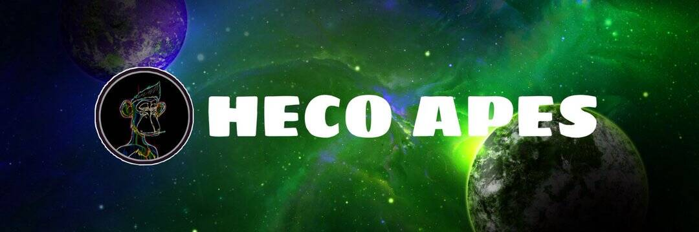

# Heco Apes

HecoApes 是一种独家的 10,000 枚可铸币优质 NFT。 这 10,000 位数字美女中没有两件是相同的。 每一个都是独特而原始的，有一个稀有的顺序，使某些比其他更有价值。 每个无聊猿的灵感都来自其以太坊对应物。
HecoApes是Heco区块链上的第一只猿，每个人都可以获得一只猿。 好吧，只要你在前 10,000 人之内。 所有类人猿将花费相同的金额。

HecoApes 是 Heco 仍处于新生 NFT 领域的首批高质量艺术项目之一。 他们的以太坊同行已经在二级市场上以超过 100 ETH 的价格交易

