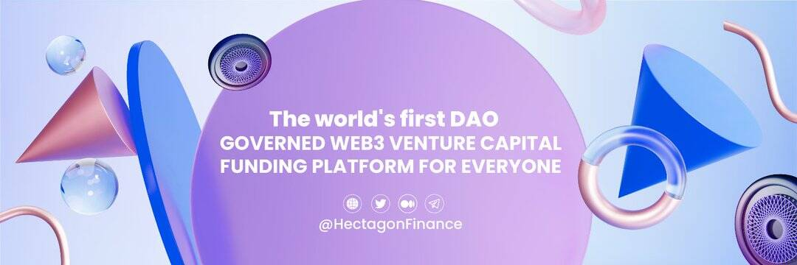

# HECTAGON

Hectagon Finance - 世界上第一个由 DAO 管理的 Web3 风险投资融资平台，适合所有人。 散户投资者购买 HECTA 以建立资金库，DAO 将投资于种子、私人 Web3 投资，从而使 HECTA 持有者受益。 不仅为 Hectagon 还为协议投资的项目做出贡献的 HECTA 持有者也因其价值贡献而获得代币。
Hectagon 希望改变 VC 融资与 Web3 项目合作的方式，项目代币将被长期锁定，同时让每个 HECTA 持有者都可以自由退出。少数投资者拥有大量的 web2。
如果我们什么都不做，那么同样的事情也会发生在 web3 上。
这是我们建造的原因之一
@HectagonFinance

第一个将 web3 回馈社区的去中心化风险投资

