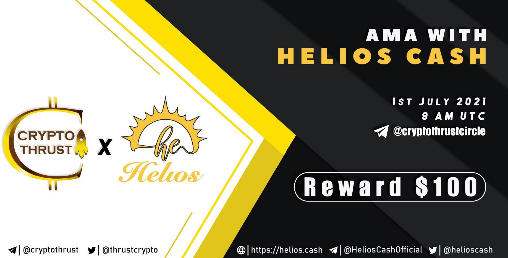

# Helios Cash

金库交换
Helios Cash 是在多边形链 (MATIC) 上运行的收益农业聚合器。DApp（去中心化应用程序）旨在优化 DeFi（去中心化金融）用户与 DeFi 空间中的其他 DApp 交互时的收益。
Helios Cash 是在 Polygon 上发起的，没有预售，没有预售，目标是以尽可能低的成本优化 DeFi 用户的收益耕作（显示的所有 APY 和 APR 都已包含费用）。
Helios Vaults 是一个收益优化器平台，专注于为 DeFi 用户提供经验最优间隔的 helios 复合收益，同时通过经过实战考验的智能合约代码和一流的收益优化策略来汇集 gas 成本。 Helios Cash 使用专有的动态收割优化器来实现我们金库的最高 APY。
“只有 Helios Cash 的最佳收益”
Helioswap 是一个 DEX 聚合器，可让您从 DEX 交易中获得最优惠的价格。 Helioswap 将您的交易拆分到多个 DEX 上，以确保获得最优惠的价格和最低的滑点。您与 Helioswap 的交易也变得不可提前交易且不可套利。
“Polygon 最好的 DEX 聚合器”

