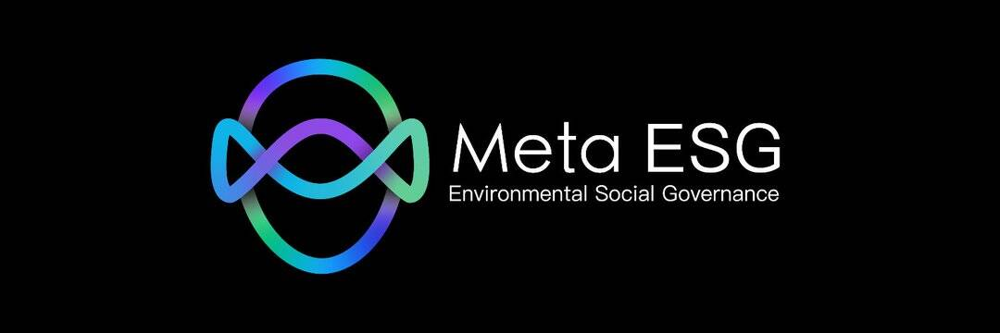

# HELIUM-3

HELIUM-3 是一款具有元宇宙概念的 NFT 游戏，任何人都可以购买和拥有宇宙飞船票、创新的收藏卡机制和令人兴奋的能量分配机制。该游戏结合了两全其美 - 对于想要享受游戏体验的普通玩家来说是一个有趣的叙述，以及即使他们不知道 NFT 是什么也想要收集和交易 NFT 的玩家生态系统。
HELIUM-3 不仅仅是区块链玩家的游戏。它也是一款可以在全球范围内引入无数玩家的游戏。
该游戏专注于生态和地球的能源危机，玩家可以轻松地从一个通用平台发货。我们的主要比较线是在传统游戏市场和生态环境市场，我们的受众针对的是相同的玩家。我们正在创新一种将令人兴奋的环境生态与区块链功能联系起来的新方法。
游戏的设计方式允许玩家通过对船行使权力来“挖掘新能量”。

