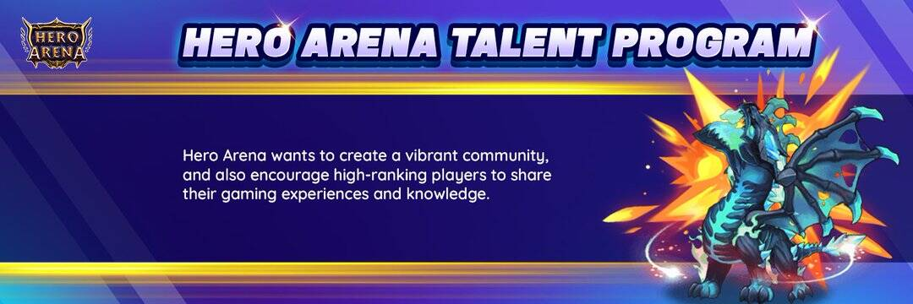

# Hero Arena

英雄竞技场是一款基于区块链技术打造的元界RPG游戏。 我们从 Dota2 游戏中获得灵感。 这是一个未来主义的世界，有 5 个不同的派系，每个派系都有自己的长处和短处。 玩家可以招募英雄，然后可以用来在战役模式中进步并与敌人作战。 在战斗竞技场中，玩家可以从你的敌人那里获得利润。

⚔英雄竞技场 - 💰基于 Binance Smart Chain 和 Polygon 开发的最佳 Metaverse RPG 游戏🎮

