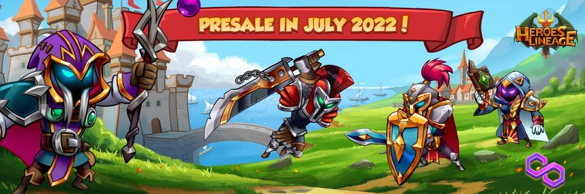

# Heroes Lineage

一个古老的邪恶在埃特尼亚世界再次崛起，所有地区的英雄都聚集在一起准备和击败这个威胁。穿越冰封山峰的寒冷景观，一直到燃烧之地的干旱沙丘，打败你的敌人，帮助在埃特尼亚恢复和平！
在这个广阔的世界中，您将面对许多危险的生物，包括强大而可怕的生物，这需要一群冒险家共同努力才能将它们击倒！训练你的英雄解锁新的和强大的能力，为他们装备在 Eternia 周围锻造的最好的装备，并击败这个潜伏在任何地方的古老邪恶！
战斗
战斗系统是回合制的，每一回合都包括两个阶段。
动作选择：每位玩家选择4位英雄各自执行的技能。你也可以不选择英雄的行动作为策略，在下一回合节省法力，并做出更强大和更精细的技能组合。
战斗：所有英雄的动作按顺序执行。同样重要的是要记住，您选择英雄动作的顺序与他们在战斗中执行的顺序相同。在这里，策略开始发挥作用，知道如何预测对手将要做什么。
游戏世界
Heroes Lineage 的世界将被划分为充满挑战和冒险的区域。您必须从游戏的初始区域升级到更高级的区域才能达到最高级的内容。
奖励
任务的奖励将主要是您的英雄的 $Tokens 和 Experience。只有您活跃的 4 人小组中的英雄才能获得经验，因此如果您想升级您拥有的其他英雄，您必须在您的团队中轮换他们，以便他们在任务期间也获得经验。

