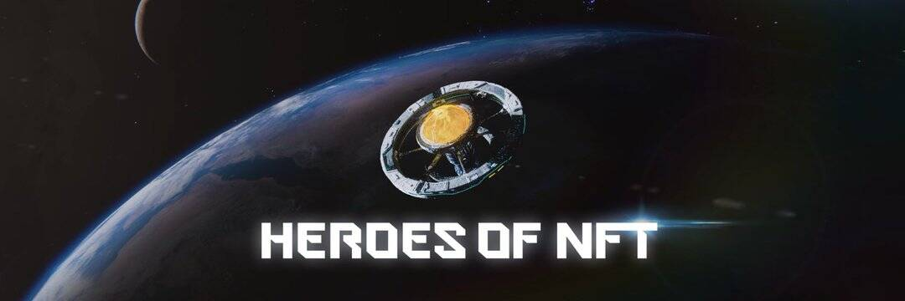

# Heroes Of NFT

什么是 NFT 英雄？ NFT 英雄是一款 P2E 纸牌游戏，其中每个 NFT 都是独一无二的，并且在游戏金融中包括具有收益农业可能性的加密货币。 NFT 英雄是一款回合制可收藏集换式卡牌游戏。玩家可以在竞技场中战斗，并通过独特的英雄卡炫耀他们的技能。永无止境的可能性将使竞争对手成为真正的战略家的考验。
虽然游戏内物品将极大地改变游戏节奏，但未来各种游戏模式将让玩家体验不同的挑战。用户在严肃的比赛中相互对抗，获胜者将获得丰厚的奖励。有限的传奇 NFT 英雄卡是等待那些获胜者的奖品。
钱包拥有的咒语卡、武器和化妆品将为您的英雄带来额外的力量和额外的自定义选项。此外，这些商品将在 NFT 市场上出售，为 HON 经济带来更多销量。
我们新颖的 Play 2 Earn 机制将允许玩家成为实体经济的参与者。 PvP 和 PvE 模式分别用可铸造的 HRM 代币奖励，而真正的奖品则在严肃的比赛中分发。 HON 代币持有者将指定游戏的未来，因此他们将成为真正的游戏大师。拥有所有这些功能，NFT 英雄将自己与其他人区分开来。

