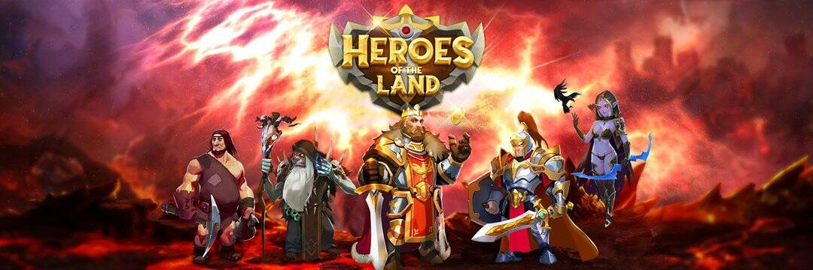

# Heroes of the Land

大地英雄是区块链世界上第一款 MMO RTS 游戏。我们在 NFT 游戏领域引入了一种新的赚钱概念：免费赚钱。
我们的常设特点：
MMO 组件：这个令人满意的功能为您的攻击创造了一个生动活泼的舞台。同一服务器上的数百或数千名玩家可以参与一个巨大的持久开放世界。玩家可以与其他玩家组队参加联盟战，例如公会战、锦标赛、部落对部落、..
单人模式：玩家可以花时间建造王国、收获资源、进行技术研究、训练士兵以自己的方式发展王国。
免费赚取：在一场游戏中免费玩和玩赚取！与其他 NFT 游戏初学者需要投入大量资金开始时不同，在《大地英雄》中，您可以决定是免费开始还是通过拥有强大的英雄/土地来获得巨大的优势。
赢取它——享受它：在《大地英雄》中，我们关心游戏玩法、图形和技术兼容性。游戏的视觉呈现水平相当高。图形很吸引人，色彩丰富，完全是卡通风格，灵感来自传统的 RTS 类型，但在 NFT 游戏中很少见。
长生命周期：我们很自豪地说我们专注于游戏的未来。在著名出版游戏公司拥有 10 年以上经验的核心团队是出色故事情节的傻瓜。我们的目标是在 6 年内先完成它，然后再往上走。借助开放的非线性结构，您可以自由地编写自己的故事。

