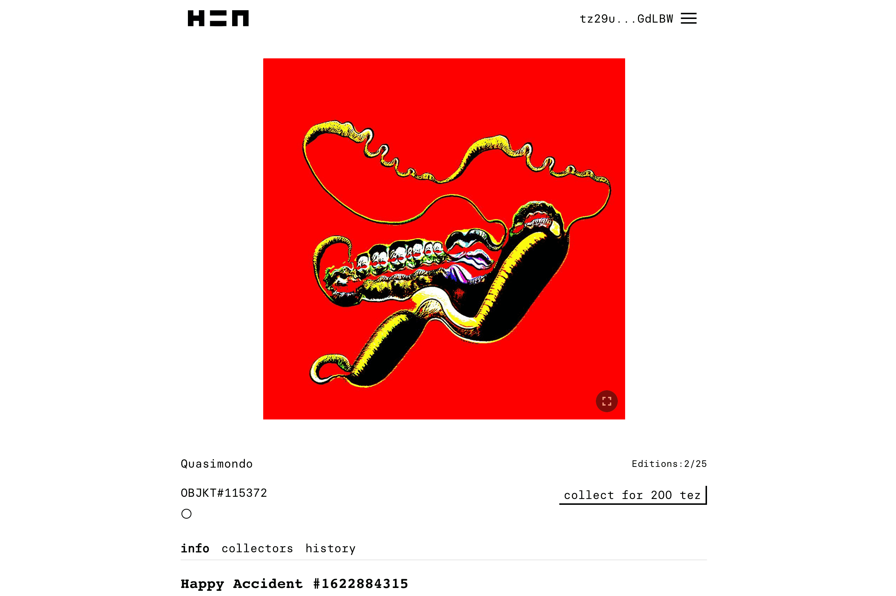

# Hic et Nunc

Hic et Nunc（缩写为 H=N，意思是“此时此地”）已迅速成为全球实验创作者的领先加密艺术市场。 H=N 平台结合了艺术家需要的具有成本效益的实用工作人员以及他们关心的环保特性。 它继续发展为一个由志愿者开发人员社区协作构建的开源、准系统平台。 它没有邀请系统，也没有看门人——只有不断的图像、交互对象、音频实验和其他媒体流。

为什么选择 Hic Et Nunc (HEN)？
HEN 利用 Tezos 区块链铸造和交易 NFT - 截至 2021 年 5 月，HEN 是增长最快的铸造和交易 NFT 市场，它得到了艺术家社区的支持，他们互相支持、购买、销售和推广彼此的作品。

为什么选择 Tezos？
Tezos 区块链依靠股权证明与工作证明来运作，这使得创建、销售和购买 NFT 变得更便宜、更环保。在 Tezos 上铸造 NFT 的 Gas 价格约为 10 美分，而在以太坊上约为 100 美元

