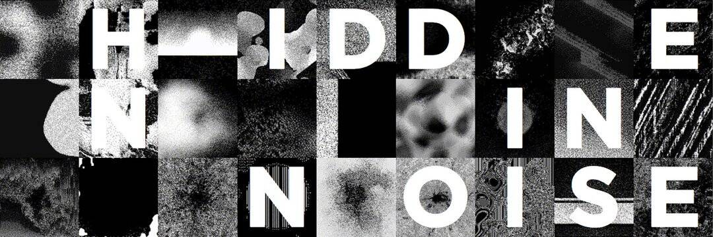

# HIDDEN IN NOISE

以太坊区块链上的静态 NFT

404.zero 的视觉和声音

隐藏在噪声 NFT 集合中。
1024 件视听作品
. 👽👽
掉落日期将很快公布。
敬请期待 - 不和谐 → https://discord.com/invite/hiddeninnoise ⚡️⚡️ gm 😎

我们总是乐于了解更多关于我们的收藏和更新网站。 此记录是否包含您认为我们应该改进或更改的不准确信息或语言？ 在这里联系我们。

请注意，当您访问时，这件特定的艺术品可能不会出现。 别担心——我们有很多展览供您探索。

With Hidden Noise 是对声音艺术的探索，邀请画廊和博物馆的参观者花时间用他们可能不知道的耳朵聆听……以马塞尔·杜尚（Marcel Duchamp）的现成的弦球命名，其中包含隐藏在褶皱中的神秘发声物体，这个盒子里的展览汇集了令人回味的声音，一些可以从传统乐器和现场录音中识别出来，而另一些则通过电子过程进行掩饰。

