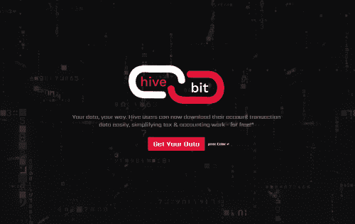

# hiveBIT

hiveBIT 是 Hive 区块链上的第一个 DApp，它允许用户将他们的整个交易历史导出到 CSV 文件 - 免费！
我们目前正在与 Koinly.io、CoinTracker.io、CoinTracking.info 和其他加密税收/投资组合跟踪 DApp 等公司合作，以完全集成我们的 API/同步服务。
任何拥有 Hive 帐户的人都可以简单地访问我们的网站 (https://hivebit.io)，输入他们的帐户用户名和电子邮件地址，然后像闪电一样快速地收到完整的 CSV 导出到他们的收件箱 - 免费。
我们的 CSV 文件目前可以导入到各种现有的税收和投资组合 DApp 中（可能需要在 CSV 文件中进行一些自定义标题调整，因为每项服务导入数据的方式彼此不同）。我们的团队正在努力创建各种模板以匹配各种服务，从而创造无缝体验。
我们还开发了一个 API 作为一项高级服务，只需支付少量年费，就可以在用户的​​ Hive 帐户和他们的加密税/投资组合软件/DApp 之间进行“同步”访问。
hiveBIT.io 计划为 Hive 用户提供一整套营销工具，专注于帮助用户扩大外展范围并分析他们的流量和指标。

