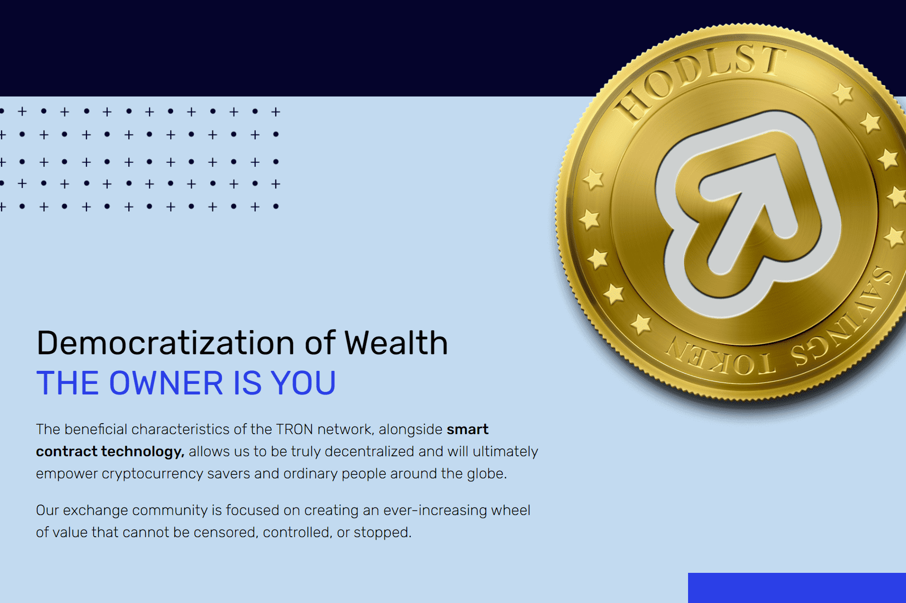

# Hodl Savings Token

HODL Savings Token 的目的是创造一个无法停止、控制或审查的价值不断增长的轮子。 HODLST 价值存储不能赠送或转让；必须购买。
随着大众的涌现，代币价值不断增加，您可以随时间持有它以节省更多资金，也可以随时出售以获取利润。

没有领导要服从。没有业主妨碍。前方的道路只有可预测且无法逃避的承诺。

代币经济学
数学很简单，任何人都可以理解。从单个地址进行的每笔新交易将使 HODLST 代币的价格增加 0.0001 美元（100% 美分）。每 100 笔有效交易，HODLST 代币的价值将比之前的固定底价增加 1 美分。

