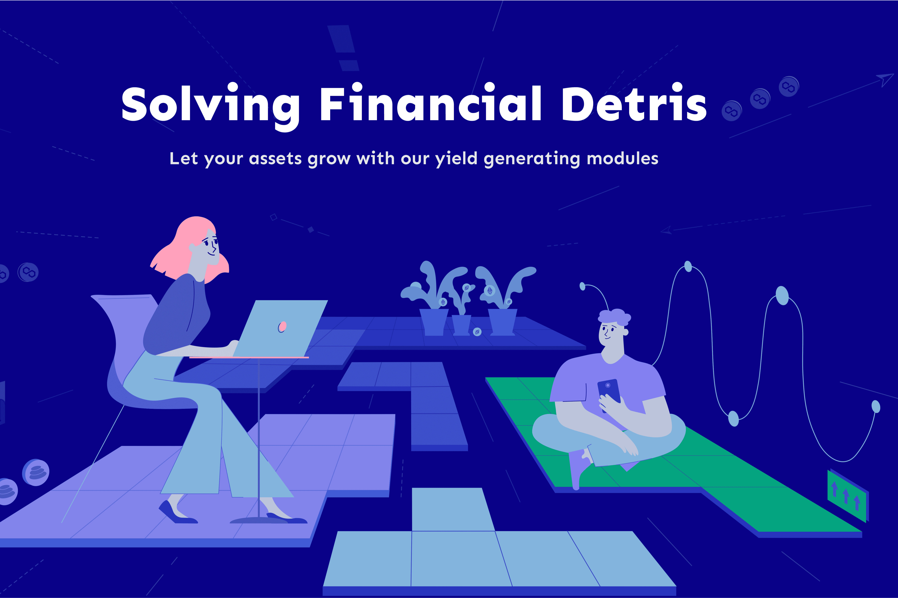

# HodlTree

HodlTree 为 DeFi 社区重新设计了金融工具，为熟悉的金融工具（如无息贷款）提供了增强功能，并为用户带来了新功能。我们的工具包包括 Flash Loans 2.0、StableSwap 2.0、Elastic Hedge Modules 和增强的 Lend &amp;借2.0。

Flash Loans 2.0 模块上线
！我们很高兴成为#Polygon 生态系统的一部分，并为社区提供开创性的#HodlTree 工具！ 0滑点换稳定币，低佣金交易！

HodlTree 正在为新兴的提交链的用户开创 Flash Loans 技术。闪贷 2.0 模块在以太坊网络上显示超过 400% 的利用率，现在在 Polygon 上运行。

Polygon 技术与 HodlTree 创新一起，将在低成本佣金和高速网络环境中向 DeFi 社区开放 Flash 贷款和稳定币兑换工具包，从而扩大项目受众，使用户体验无缝且愉快。

Polygon 快速发展的生态系统及其服务的可负担性为套利者提供了更广泛的机会。这就是为什么 HodlTree Flash Loans 2.0 模块将成为完美完成生态系统的部分。

HodlTree Flash Loans 2.0 模块的主要创新之一是可以选择以不同的稳定币（或几种硬币）偿还闪电贷款，而不是以稳定的 1:1 回报率获得贷款。这为各方创造了互惠互利的条件，因为它扩大了套利的可能性范围，并使流动性提供者有机会获得比现有产品更高的资本百分比。

Polygon 上推出的 Flash Loans 2.0 模块专注于使用稳定币，目前支持 USDC、DAI 和 USDT。其他硬币将在不久的将来添加。

Flash Loans 2.0 为 DeFi 用户引入了另一个独特的功能 - 利润丰厚的稳定币交易所，零滑点和更有利可图的佣金，比流行的 DEX 提供的佣金低三倍。

正如在以太坊上运行的 Flash Loans 2.0 的经验所证明的那样，该模块可以为套利者和流动性提供者开辟新的机会。由于 Polygon 降低的 gas 费用为稳定币交易提供了独特的套利机会，HodlTree 团队预计此次整合不仅会带来 Flash Loans 2.0 的广泛扩展，还会为借款人和流动性提供者带来更有利的条件。

