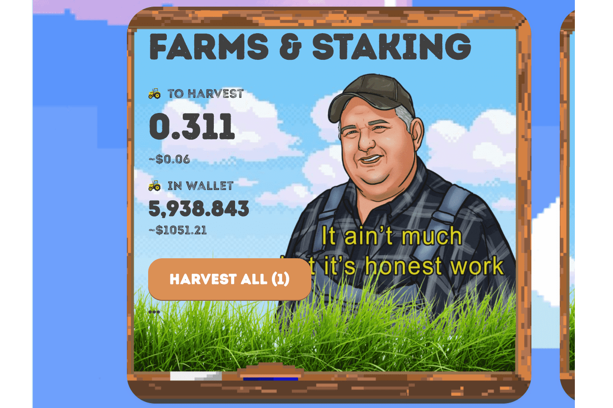

# Honest Work Farms

Honest Work Farms 是 Polygon 上的固定供应通缩代币，上限为 432,144 🚜

这个充满活力的农业社区的目标是双重的：

  提供稳定的收益流
  提供对价格波动和波动的保护。

为了实现这些目标，我们的农场坚持丰收的原则。首先，建议您了解一些 Honest Work 的基本代币经济学。
否则，通过前往 Quickswap 获得一些 $🚜，让您的拖拉机运转起来。

Honest Work Farms 是一个赚取被动收入的 dApp。该平台旨在为用户提供稳定的收益和免受价格波动的影响。农场的原生代币是诚实的。它有 432,144 个代币的固定供应。可以通过质押 LP 代币来获得代币。

