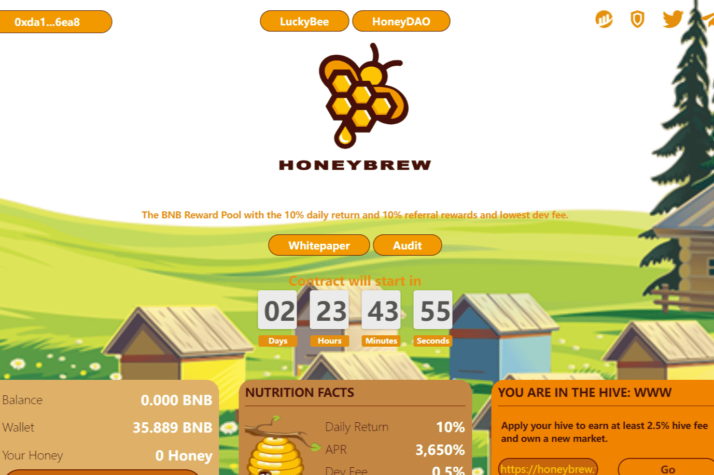

# Honey Brew

HoneyBrew 是第一个实现蜂巢的“矿工”协议。我们相信，每一位投资者都是一只“蜜蜂”，酿造蜂蜜作为回报。每只蜜蜂属于一个蜂巢，每笔押金的至少 2.5% 将作为蜂巢费用直接寄给蜂巢主人。最具创新性的是，每个蜂巢都是一个独立的市场，具有单独的池余额以及单独的蜂巢费用和推荐奖励设置。
HoneyBrew 为每个雄心勃勃的投资者提供了进入自己蜂巢的机会，他们可以开发自己的市场并找到更多的蜜蜂一起酿造蜂蜜。所有的蜂巢都将把合约余额推到一个超巨量，这将使 HoneyBrew 成为一个基于社区的金融巨头。
HoneyBrew 为所有投资者提供了一个非常公平且赔率合理的基于区块哈希的赌场小游戏平台。每个赌注的2.5%将用于支持长期发展，其中70%留在余额中作为储备，20%直接给蜂巢所有者，10%进入蜂巢余额池制作每个蜂巢更健康，更长久。

