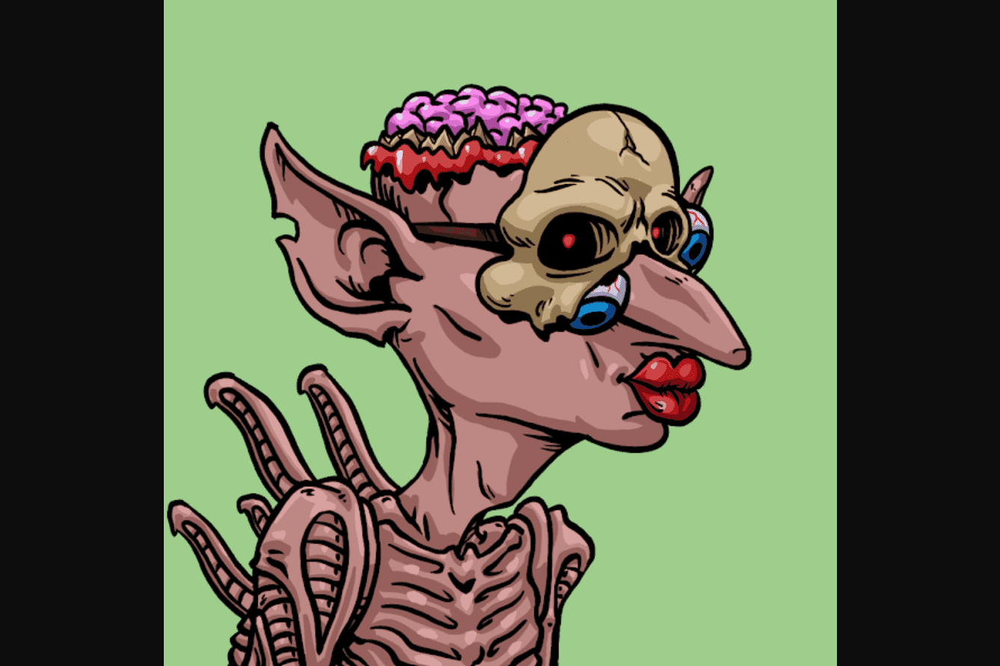

# House of Goblins

The House Of Goblins 不仅仅是一个手绘随机生成的 NFT 集合，它是一个多维度的区块链游戏。一款地精可以开采地精矿石 ($GORE) 的游戏。

很久以前，地精在群山中游荡，对所有踏入其领地的人构成持续威胁。虽然身材矮小，但这个喜怒无常的种族在数量上拥有强大的力量和无与伦比的小气。事实上，他们自己的队伍之间的小规模冲突会因为不为你身后的地精开门而爆发。

地精种族唯一能达成共识的是他们对 gore img symbol$GORE 的不健康的痴迷。一种具有巨大强度和美丽的发光绿色矿物，gore img symbol$GORE 被用于从建筑材料到调味烤老鼠的所有东西（虽然没有外人尝过它，但传闻它尝起来像在下水道水中滚动的发霉奶酪）。

有一些勇敢的灵魂进入了地精领域试图与他们交换这块神秘的岩石的故事，但那些幸存下来的人通常被留下为明显缺乏手指的喃喃自语的傻瓜。在外人看来，哥布林世界永远遥不可及。

地精不喜欢分享，包括他们称之为家的山脉。对他们来说不幸的是，这些山脉的内容也被其他物种所觊觎，而地精王国发现自己受到了矮人和害虫敌对国家的攻击。这场战争被称为短筹码战争，是历史上任何身高低于 4 英尺的种族中最血腥的冲突。尽管这场战争从未有任何一方取得决定性胜利，但地精们还是失去了阵地，并进一步退到了山下。

几个世纪以来，他们生活在地下，与世隔绝，从未见过日光，直到 7 月 4 日的一天后，烟花悲剧创造了一个足够深的洞，足以穿透地表下的洞穴网络。起初，哥布林们小心翼翼地出现，然后才鼓起勇气走出洞穴，进入人类社会的各个角落。他们从远处观察人类，研究他们目睹的特殊行为。

在发现当地的垃圾填埋场后，他们相信他们发现了一个人类宝库，可以与他们自己的戈尔 img symbol$GORE 储备相媲美。不久之后，他们开始模仿他们所看到的并使用他们发现的东西，经常将这些新行为带回地精社会。他们对 80 年代的动作片和浪漫民谣等产生了兴趣。地下生活将永远改变，但有一件事从未改变，他们对那颗心爱的绿色岩石的热爱，gore img symbol$GORE。

