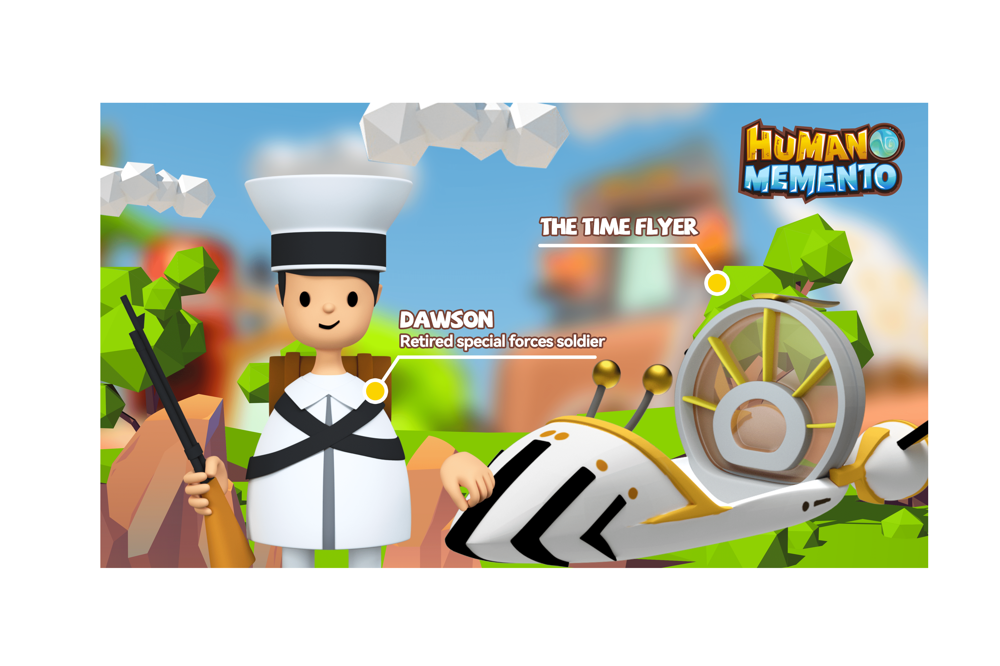

# Human: Memento

Human: Memento 是一款科幻类 NFT 游戏，旨在为用户提供有趣的体验，通过收集 Explorer 和 Time Machines 回到过去搜索 $EPK 的时代。

很久以前，一场流行病夺走了99%的人的生命。人类文明的大量成果在这场浩劫中永远消失了。我们作为幸存下来的人类，已经逐渐恢复生产。我们开始借助仅存的时间机器探索过去的时代，以收集人类文明的纪念品，以完成缺失的人类知识库。

Human: Memento 是一款科幻游戏赚取 NFT 游戏，旨在通过收集探索者和时间机器来为用户提供有趣的体验，让他们回到过去的时代搜索 $EPK，这种矿物可以让他们多活一天并在此过程中赚取一些利润。
游戏部署在币安智能链上，兼容MetaMask等web3钱包，用于接受交易和支付gas费用。 MetaMask 可以作为浏览器扩展程序安装，也可以作为移动设备上的应用程序安装。
资产是按照 ERC-721 标准铸造的玩家拥有的 NFT，可以在我们的市场上交易或通过 P2P 将它们出售给其他玩家。

