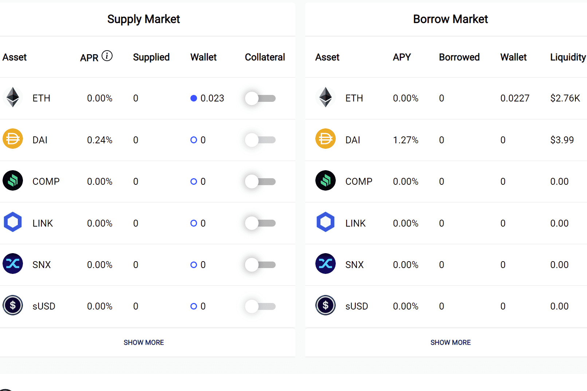

# Hundred Finance

自 2020 年去中心化金融生态系统大受欢迎以来，借贷平台已成为加密货币领域的核心基础设施。它们不仅为用户提供了“持有”或利用其加密资产的能力，从他们的投资（加密支持的贷款）中获得流动性，同时赚取利息，它们还支持其他协议的运作。资产从以太坊主网转移到与 EVM 兼容的区块链和扩展解决方案并没有改变这一点。授予借贷能力的平台是用户在任何新兴链中寻找的关键应用程序之一。 Hundred Finance 旨在在自 2021 年初蓬勃发展的多链环境中提供这些服务方面发挥核心作用，以无需信任、安全且经济高效的方式为越来越多的用户提供赚取收益和借入资产的自由.

