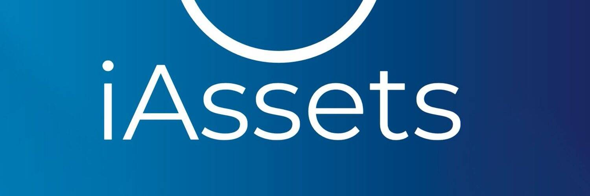

# iAssets

iAssets 为创作者提供区块链技术。 iAssets 旨在开发基于 NFT 的产品和服务，以构建资产互联网。
新架构✅
设计⚙
白皮书⚙
发展⚙
铸造 100 个 NFT == 10 美元 ✅

iAssets.Market
比以往任何时候都更实惠地将任何东西表示为独特的数字资产。

iAssets.Marketing
允许您管理整个广告活动并有效地发展您的业务。

iAssets.Social
去中心化的社交媒体，言论自由，没有任何审查。

