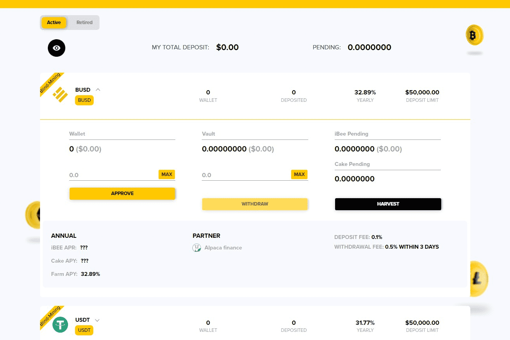

# iBee Finance

iBee Finance 是币安智能链上的下一代收益优化器，使用创新的协议库系统。
我们是 BSC 上第一个独家单一资产高收益优化器，在每个金库中奖励三种不同的代币。
我们创新的保险库不仅消除了无常损失 (IL)，而且还优化了稳定的回报。我们的 7 天平均年利率非常准确，波动性很小。我们已经对我们的结果进行了长时间的测试，以确保我们的用户将获得稳定的收入。我们还将 Cake 代币设计为 APY 的一部分。 Cake 代币与所有代币一样具有波动性，但您的整体 APY 会增加，因为这是奖励奖励。为了平均分配这些蛋糕奖励，您必须每 7 天收获一次。您可以随时提取资产，但不会收到蛋糕红利奖励。因此，只需在金库中停留 7 天，奖励奖励就值得等待。
大多数像 Pancakeswap 这样的平台都会奖励他们的农民提供流动性。这意味着您必须创建一个 LP 代币。这个 LP 代币是有代价的。为了制作这个 LP 代币，您必须结合两个不同的代币。由于您正在组合令牌，因此一个令牌的上升或下降速度将比另一个更快。这会导致难以恢复的无常损失。这就是为什么我们只提供单一的质押金库。这将消除任何无常损失，取而代之的是，我们使用收益优化协议来实现单个质押金库的最高收益。

