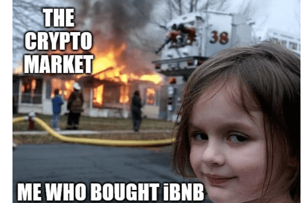

# iBNB

⚠️ 2021 年 6 月 29 日推出 | | 180 万市值⚠️
📱 电报：ibnbfinance 📱
⚫️  iBNB  ⚫️
iBNB 是第一个也是唯一一个动态 DeFi 代币。每天赚取BNB，只为持有iBNB
介绍我们革命性的动态税收协议 (DTP)，这是确保为投资者提供可持续 BNB 奖励池的秘诀。
⚖️ 动态税收协议
📈 可持续的 BNB 奖励
🔹 10% 交易税
🔸 高达 9.9% 进入 BNB 池
⏱ Bot 免费预售 10 秒售罄
🔥 流动性在启动时被烧毁
🚫 缩放反倾销机制
✅ 合同审核和验证
📜 合约 | 0x830F7A104a3dF30879D526031D57DAa44BF85686

