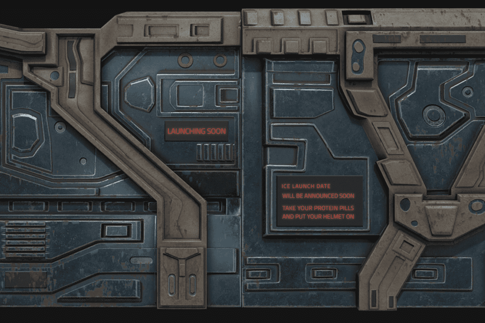

# Ice Colony

Ice Colony 是一款 GameFi。该 dapp 将在其后期阶段展示 NFT 集成、基础构建游戏和纸牌游戏。

自地球上的矿藏枯竭以来，已有数千年的历史，人类将注意力转向了太空。如今，小行星采矿在整个宇宙的几个殖民地是一种常见的做法。这些小行星通常是从一个名为 ICE Colony 的基础行星上开采出来的。不像名字所暗示的那样，这些殖民地不一定是冷的。 ICE是Insentient Celestial Excavator的缩写。这些是在殖民地进行生产和采矿作业的有机机器。它们被认为是现代意义上的牛群，是太空时代最有价值的投资。
除非您自己是某些 ICE 的所有者，否则 ICE 殖民地的生活极具挑战性。然后，这很容易，因为您只有两项工作要做，然后才能充实自己的口袋

