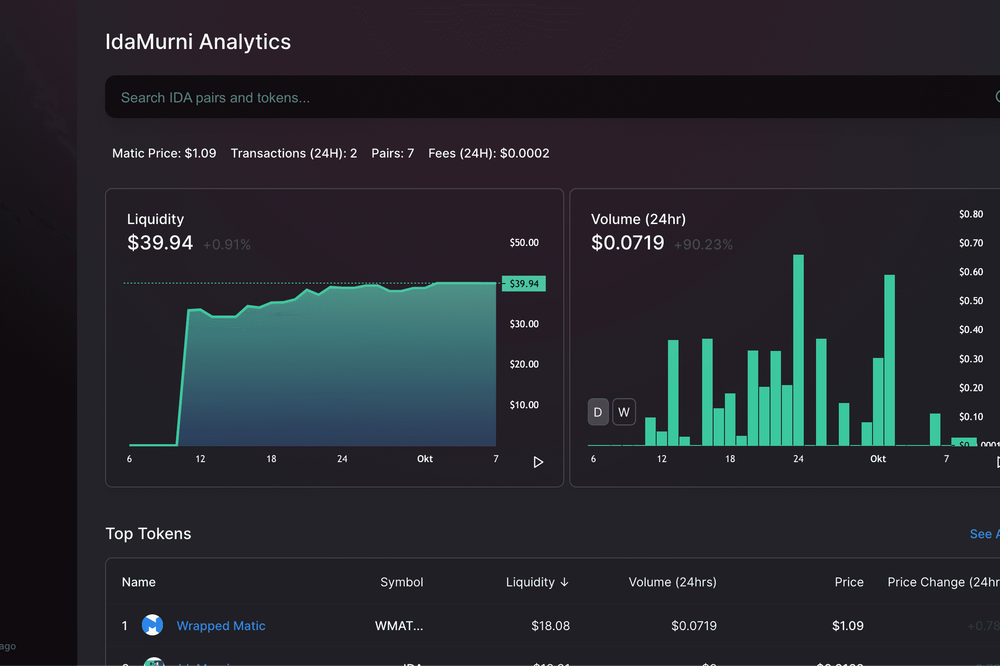

# IdaMurni

IdaMurni 项目方案的出现是因为我认为有必要以不同于旧的传统市场方式来处理税收以及如何管理它们的方式来思考。这并不意味着 IDA 将取代今天的任何传统市场，但在多区块链中为自己的生态系统服务将赋予未来参与的灵活性和机会。
IDA 设计为具有两个编程功能的未来资产。每笔交易的前 5% 将交给它自己的 Provider，其他 5% 将调用可燃函数来降低 gas 费用。在每笔交易中的可燃代币期间，现有的 IDA 代币将与 Total Supply 的第一个代币不同。
治理：
IDA 代币的持有者将能够通过对 IDA 关于协议修订和升级的提案进行投票，使用他们的代币参与 IDA 的治理*。尽管有关投票机制的具体细节尚未最终确定，但预计每个持有者的投票将与其持有的 IDA 代币数量进行权衡。
生态系统/市场：
考虑到目前的 NFT 市场，IdaMurni 将服务于仅接受 IDA 作为支付方式的 NFT 市场。使用 IDA 的令牌，用户将能够直接从艺术家那里获得 NFT 卡和流式传输/购买音乐。

