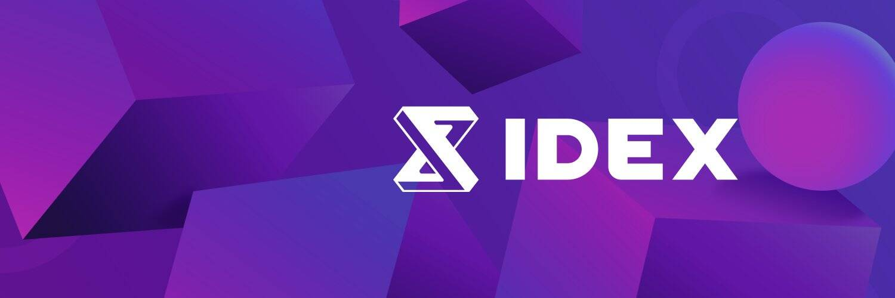

# IDEX

什么是IDEX？
IDEX 是第一个混合流动性去中心化交易所 (DEX)，将高性能订单簿与自动做市 (AMM) 相结合。该平台融合了集中式和分散式交易所的优点，具有订单簿的性能和功能以及 AMM 的安全性和流动性。 IDEX 允许交易者获得最佳点差，避免交易失败，并轻松提供流动性，所有这些都具有真实限价和止损订单的力量。 IDEX 在 Polygon Network 上可用，并计划扩展到其他网络。
不妥协 - IDEX 是第一个结合最好的订单簿和 AMM 的交易所。使用限价、止损等高级订单类型进行零点差和深度流动性交易。一键提供流动性赚取费用。
巅峰表现——先进的交易引擎带来高吞吐量和即时执行。告别失败的交易、抢先交易和高滑点。
自由与安全 - 连接您的钱包即可开始，在不放弃对资金的控制的情况下控制您的交易。由 Quantstamp 全面审核。
质押和赚取 - 质押 IDEX 以支持交易所交易引擎并赚取 50% 的交易费用。
高级 API - IDEX 的标准化 API 让您通过熟悉的界面以毫秒级的延迟更轻松地集成您现有的交易软件。
IDEX 代币是什么？
IDEX 是 IDEX 交易所的治理代币。用户可以质押代币以在交易所赚取一定比例的交易费用。

