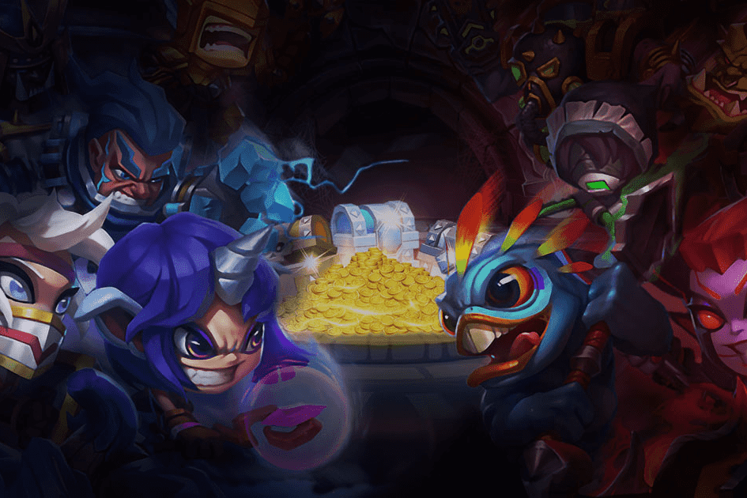

# Idle Mystic

作为全球首款 3D NFT 区块链游戏，Idle Mystic 致力于提供刺激有趣的 3D 沉浸式战斗体验，基于以太坊区块链的 IMT 代币经济，发展潜力无限，构建可持续和谐的社区治理生态。

英雄融合操作指南
为了让大家更了解如何进行英雄融合，以下是详细的操作步骤。步骤首先在网站上锁定目标英雄和材料英雄。

英雄融合功能即将推出！通过英雄融合，我们可以获得更高属性的英雄，帮助我们赢得战斗。

如何融合？

1.首先在网站上锁定目标英雄和材料英雄。然后在游戏中对英雄祭坛进行操作。

2.目标英雄和材料英雄可以在融合前从英雄祭坛中取出，没有任何限制。

3.英雄融合会消耗魔石和IMT（游戏内）

融合规则和说明

1.每个添加的材料英雄可以增加目标英雄的原始属性百分比，最多可以添加10个材料英雄。

2.融合所使用的材料英雄品质越高，融合成功后目标英雄的属性越高。

3.融合成功后，旧目标英雄和材料英雄将被摧毁。融合的新英雄只能保存在英雄祭坛中（不能使用）。玩家需要在网站上将融合后的英雄铸成 NFT，才能在游戏中使用该英雄。

4.融合失败后，有一定几率会丢失部分英雄。

5.可以使用道具增加融合成功的几率，保留失败时可能丢失的英雄。

6. 融合成功的英雄可获得星级（英雄详情会显示在网页上），上限为5星。

7.融合分为Perfect Fusion（白金之星）和Normal Fusion（金星）。完美融合的英雄会有更高的属性。

