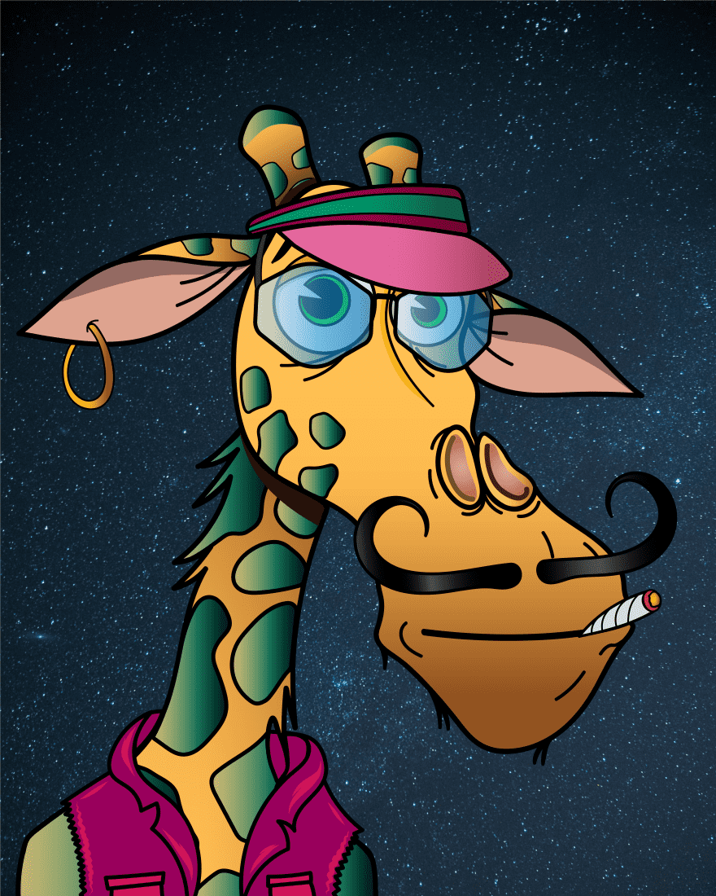

# Immutable Giraffes

NFT 收集了 10,000 只长颈鹿，计划参观 Immutable X 平台。你可以在世界各地找到它们，它们拥有无可挑剔的风格、独特的发型、配饰等等，所有这些都以完美的像素化简约风格呈现。

什么是区块链技术？是一种高级数据库机制，允许在企业网络中透明地共享信息。 区块链数据库将数据存储在区块中，而数据库则一起链接到一个链条中。 数据在时间上是一致的，因为在没有网络共识的情况下，您不能删除或修改链条。 因此，您可以使用区块链技术创建不可改变的分类账，以便跟踪订单、付款、账户和其他交易。

长颈鹿作为 ERC-721 代币存储在 ImmutableX Ethereum L2 解决方案上。
通过拥有 5 头或更多长颈鹿，您可以访问“The Longneck Takeover”——Immutable X 上的第一款移动 Play2Earn 视频游戏。长颈鹿，赢取我们的官方 $NECK TOKEN。
随意加入我们的 Discord，我们可能会赠送一些免费的 $NECK

