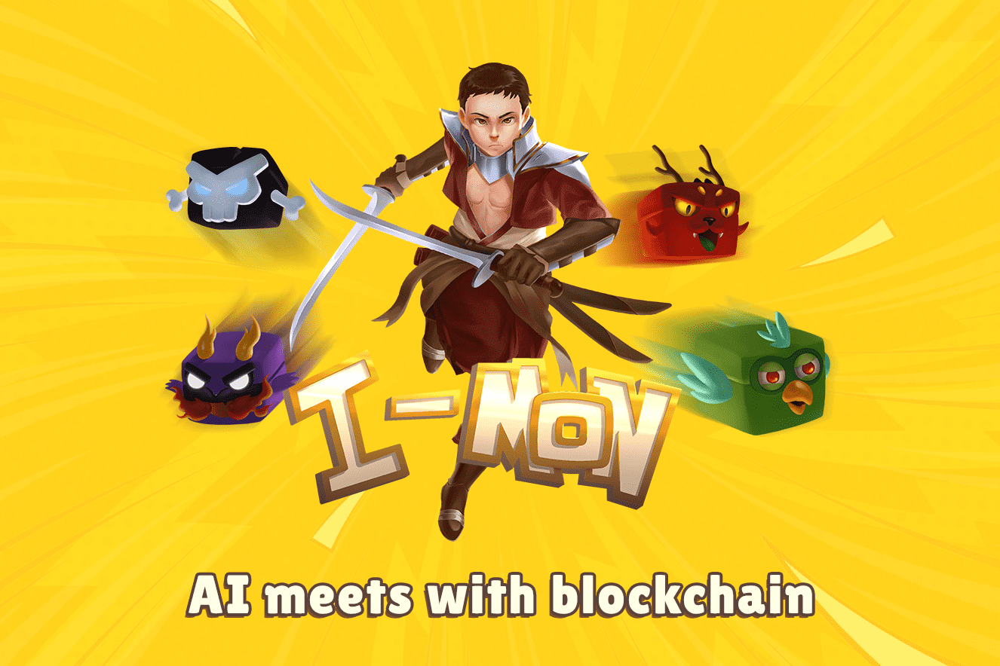

# IMON - Intelligent Monsters

我们的座右铭是“Socialize&Earn, Earn&Learn”
什么是I-MON？
I-Mon 将机器学习与区块链相结合，为所有用户创造附加值，I-Mon 是完全链上 NFT，由 ERC1155、ERC20、ERC2917 标准提供支持。这些合约还实施了 EIP-2535 Diamonds 标准，该标准允许模块化升级。
它是如何工作的？

  我们平台上的所有 NFT 都代表了区块链领域的知名人士。
  这些 NFT 与他们所代表的人的 Twitter 帐户相关联。
  当这些人从他们的推特账户发推文时，连接到该账户的 NFT 所有者有权使用此推文升级他们的 NFT。每条推文仅用于一次升级。
  机器学习能力随着 NFT 的升级而增加。同时，这一发展让 NFT 在权益池中占有更大的份额。因此，用户在社交中赚钱，他们的学习能力随着收入的增加而增加。这种发展可以让用户赚取更多。
  NFT 的发展水平受限于其学习能力，即无止境。促成 NFT 发展的主要因素是代表该 NFT 的影响者的推文。这样一来，影响者的社交性越高，NFT 所有者的社交性就越强。 NFT发展的主要因素是社交！

通货紧缩特征

  所有 NFT 都以 $IMON 代币出售。收集到的代币将被永久烧毁
  IMON 代币用于 NFT 机器学习。用户用于改进的代币将被永久销毁。

