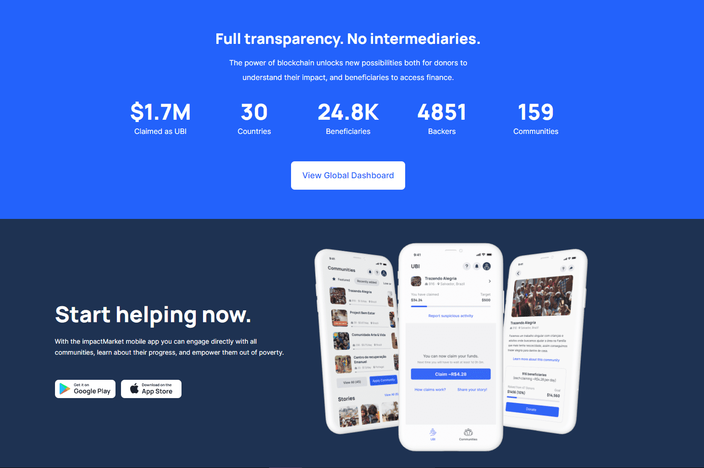

# impactMarket

ImpactMarket 是一项扶贫协议，旨在增强当地和社会变革、自下而上的经济发展和繁荣，同时推动最需要的人采用 DeFi。它目前使任何弱势社区都能获得融资并拥有自己的无条件基本收入。

什么是区块链技术？是一种高级数据库机制，允许在企业网络中透明地共享信息。 区块链数据库将数据存储在区块中，而数据库则一起链接到一个链条中。 数据在时间上是一致的，因为在没有网络共识的情况下，您不能删除或修改链条。 因此，您可以使用区块链技术创建不可改变的分类账，以便跟踪订单、付款、账户和其他交易。

ImpactMarket (impactmarket.com) 是一个去中心化的扶贫协议，它使任何弱势社区都能够实施扶贫机制，例如无条件基本收入。您可以使用我们的链上仪表板了解我们对我们支持的所有社区的影响。

