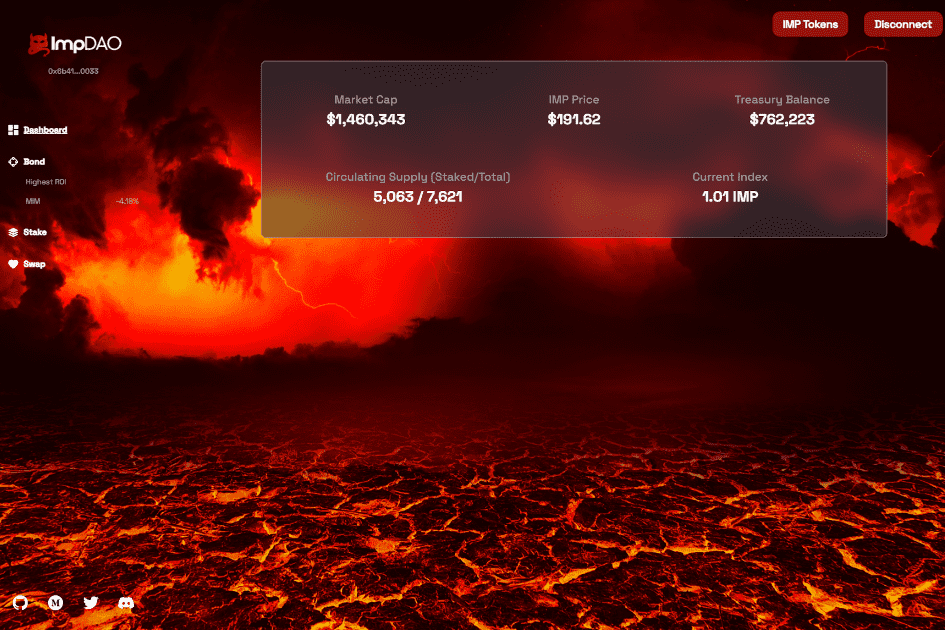

# ImpDAO

什么是 ImpDAO (IMP)？ ImpDAO 于 2022 年 2 月 12 日在 Fantom 生态系统上启动，是 Olympus 协议的一个分支，专注于积极的资金部署。 ImpDAO 利用部分储备货币技术作为筹款工具来创建去中心化 DeFi 投资基金。在短期内，ImpDAO 主要专注于“智能测试版”策略，即为 DAO 利益相关者提供对 Fantom DeFi 生态系统的多元化和预先审查的机会。中期内，ImpDAO 将遵循类似于 TradFi 投资基金的核心+卫星方式。核心+卫星战略将导致推出额外的（战略）豆荚，这些豆荚将遵循特定的投资策略，以便 ImpDAO 有效地将其资本部署到合适的市场口袋中。从长远来看，ImpDAO 的利益相关者将能够自由地将他们的资金分配给特定的策略，类似于选择现代经纪人的 ETF 分配。

