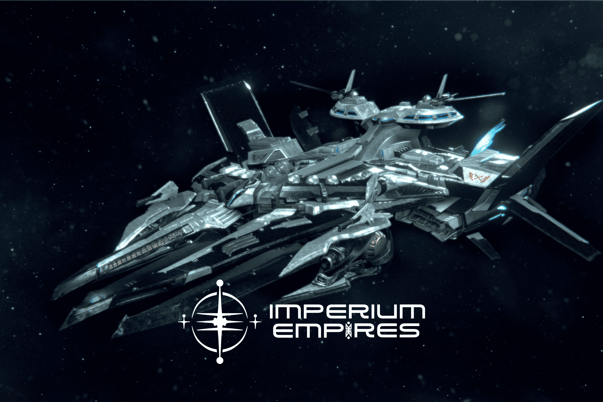

# Imperium Empires

Imperium Empires 建立在 Avalanche 区块链之上，是世界上第一个 GameFi 2.0 AAA 空间元宇宙，它 (i) 通过 PvP 战斗中的 NFT 燃烧具有通货紧缩的代币经济学，并且 (ii) 将 DeFi 游戏化，并使全球 30 亿游戏玩家可以使用 DeFi。 Imperium metaverse 是一款第三人称 RTS 游戏，具有多种 PvE 和 PvP 游戏玩法，玩家通过加入朋友公会来征服 Metaverse 并建立自己的帝国，从而组队赚钱。我们相信区块链游戏和元界仅在第 0 年，但只有那些知道如何扩展并覆盖全球 30 亿以上游戏玩家的人才能蓬勃发展。我们确定了 Imperium Empires 将解决的大多数区块链游戏中常见的 4 个主要问题： 1. 低质量的图形和有限的游戏玩法； 2. 恶性通货膨胀和不可持续的代币经济学； 3、缺乏深度的DeFi集成； 4.缺乏公会玩法。 Imperium Empires 通过以下方式解决了 4 个问题中的每一个问题2. 嵌入独特的 NFT 销毁机制，在玩家自愿进入的 PvP 区域中，可以损坏或销毁 NFT（例如宇宙飞船）； 3. 通过将 Avalanche 生态系统上的顶级 DeFi 协议集成到 Imperium Metaverse 中，将 DeFi 游戏化，并将全球 30 亿以上的游戏玩家无缝连接到 DeFi； 4. 在公会与我们的游戏玩法密切相关的情况下，开创性的团队赚钱。与我们的官方公会和学者一起管理。

