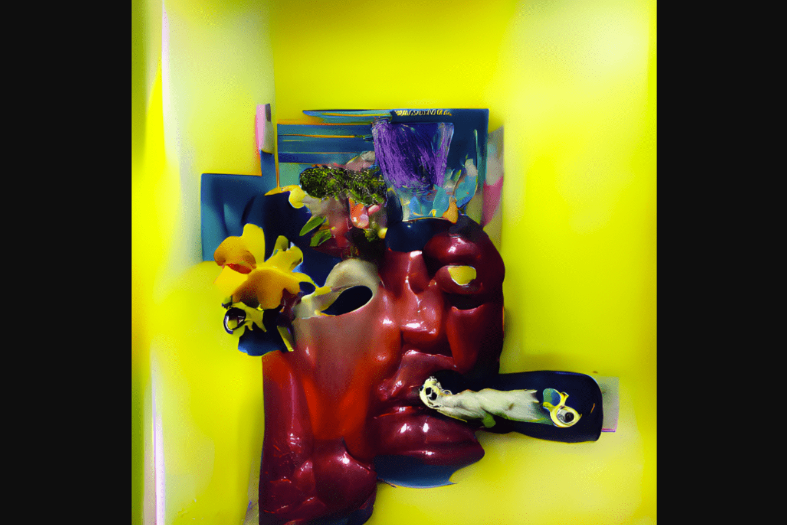

# Impermanent Digital

头像应该是自我的反映。我们是不断变化的生物——我们进化、衰败和死亡。为什么我们期望我们的化身长生不老？ ︎4444 版本 - 视觉上令人惊叹的生与死艺术作品，主题为生、死以及介于两者之间的一切。第一个系列重新想象 CryptoPunks，使用最先进的神经网络将原件老化+变形为超凡脱俗的艺术品。 ︎ 稀有特性 - 每个都有一个生命周期特性（1、2 或 3），这决定了化身可以达到多少次迭代。如果持有者选择销毁他们的最后一次迭代，他们将收到一个 AfterLife 代币，用于解锁空投和更多生命。

