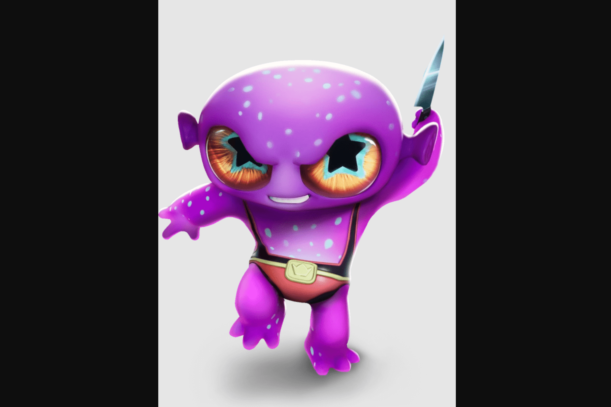

# Impostors Genesis Aliens

冒名顶替者创世纪外星人代表冒名顶替者生态系统的基础 NFT 集合，并作为冒名顶替者创世纪季的通行证，该季将举办七场独特的活动。这些星际生物中只有 10,420 个将永远存在！每个创世纪角色都具有 200 多种特征的组合，并将在各种元宇宙游戏模式中提供基于统计的优势。
Impostors 是一个社交游戏虚拟世界，它弥合了当今 Twitch 文化与沉浸式虚拟世界的未来之间的差距。该游戏采用虚幻引擎构建，团队由 30 多名世界级工程师和建设者组成，他们在 AAA 工作室工作过，包括 Epic Games、Roblox、Pixar 等。冒名顶替者通过创建一个真正由玩家拥有和支持的社交游戏元世界，为游戏和加密世界带来了一股新鲜空气。

