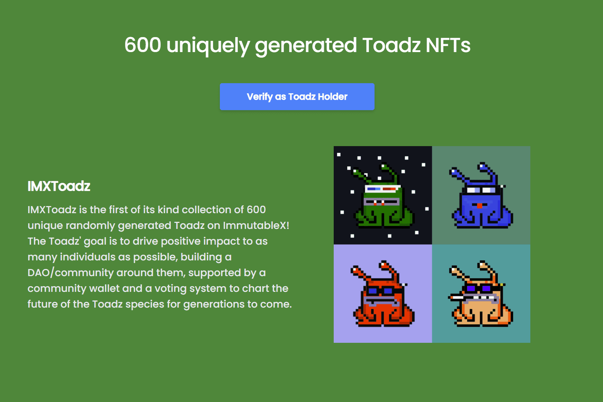

# IMX Toadz

IMXToadz 是 ImmutableX 上第一个包含 600 个独特随机生成的 Toadz 的集合！ Toadz 的目标是为尽可能多的人带来积极影响，围绕他们建立一个 DAO/社区，由社区钱包和投票系统支持，为后代描绘 Toadz 物种的未来。

600 IMXToadz 铸造 在 IMX 市场，TokenTrove 上市 稀有度排名揭晓

ITOADZ Launchpad 的设立旨在帮助新的 IMX 项目在 IMX 上轻松启动，从而加强整个 IMX 生态系统。我们的第一个合作伙伴将是 IMX Kongz。

 ITOADZ 商品将被创建并发送给持有者。 ITOADZ商店将用于商品。

[2022 年第一季度] 推出我们的下一个系列 CyberToadz 3D。 CyberToadz 3D 将在未来集成到元节（例如沙盒）中！ 1 IMXToadz = 1 CyberToadz 3D 的空投。

 $ITOADZ 实用代币。每只蟾蜍每天将产生 10 美元的 ITOADZ，为期 10 年。 $ITOADZ 将用作 Toadz 生态系统中的实用代币（未来育种、从 ITOADZ 商店购买物品的积分、未来的独家特权），并作为治理代币投票支持 DAO 提案。

