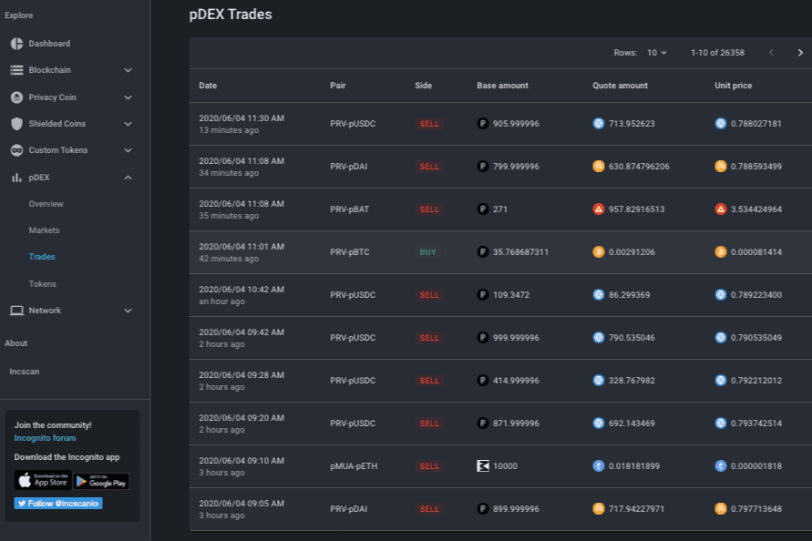

# Incognito DEX

Incognito pDEX - 是第一个允许跨链交易的机密、无需许可的去中心化交易所。这是一种不同的交换。它是非托管的（这意味着你的钱实际上是你的），它是去中心化的（完全建立在链上），它是无许可的（你可以从你的个人帐户中免费列出你的代币）并且因为它由 Incognito 提供支持 - 它是完全匿名的，当然。没有 KYC，没有买家、卖家或交易金额的记录，没有第三方风险——您可以控制自己的资金并持有自己的私钥。它还通过自动做市机制促进即时匹配（稍后会详细介绍），并为任何人提供成为流动性提供者并赚取一定比例交易费用的机会。总之，Incognito pDEX 具有这些令人难以置信的特性：去中心化、可扩展和跨链流动性。从现在开始，用户可以在 100% 保密的情况下交易 BTC、ETH、PRV 等。

