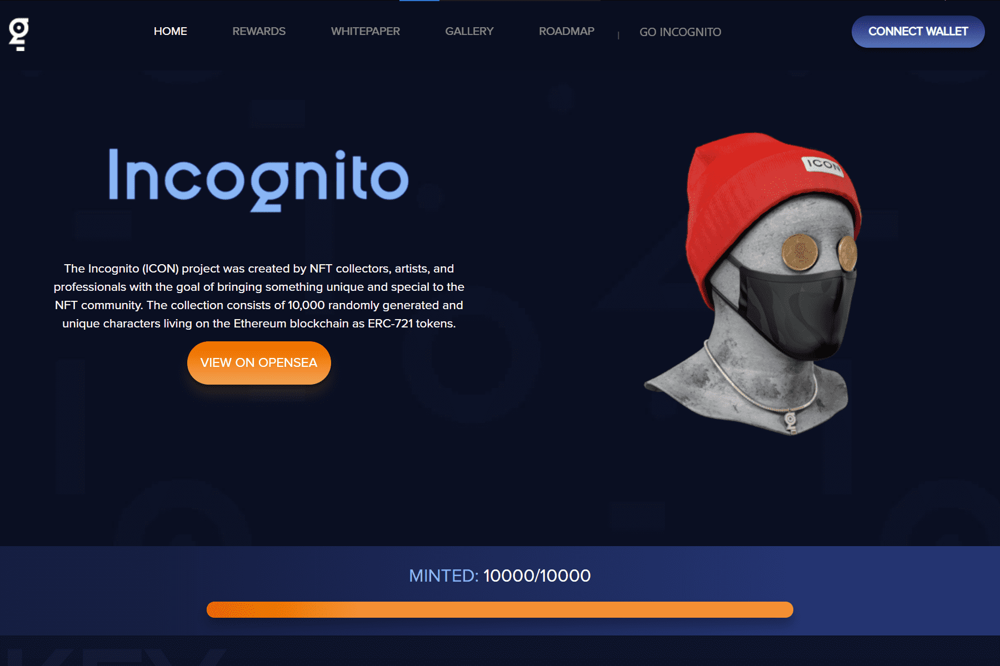

# Incognito

Incognito (ICON) 项目由 NFT 收藏家、艺术家和专业人士创建，旨在为 NFT 社区带来独特而特别的东西。该集合由 10,000 个随机生成的独特角色组成，这些角色作为 ERC-721 令牌生活在以太坊区块链上。
超过 500,000 美元将作为对所有隐身收藏家的奖励。我们的奖励经过精心挑选，将数字和实体艺术世界的元素融合在一起。从连帽衫到 8 万美元的画作。
每个 NFT 都将有可下载的内容，这些内容将在个人资料页面上提供，收藏家可以访问 3D 文件以进行 3D 打印、渲染、预制动画以及您的 Incognito 的完整 6k 分辨率图像。
凭借良好的基础和管理该系列的专业团队，我们可以设定目标，将我们带到真正的空间。我们有一个具体的路线图，其中包含未来 4 个多月的目标，以进一步发展这个项目。

