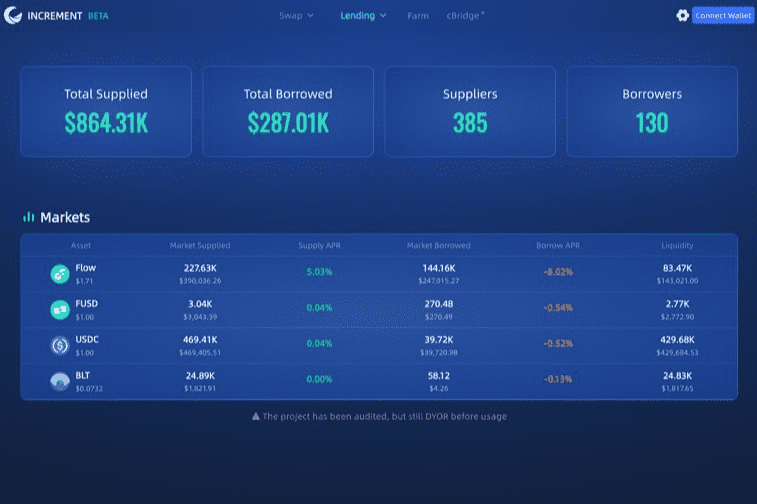

# Increment Finance

IncrementFi 是一站式 DeFi 套件，在 Flow 区块链上提供流动性（IncrementSwap：permisionless AMM DEX）和收益（IncrementEarn：代币去中心化货币市场）解决方案。
NFT 农场是 IncrementLabs 在 Flow 上推出的一种新型实验。它允许 nft 持有者通过将他们的 NFT 质押到特定的矿池中来获得一些额外的代币甚至是一些新的 nft 奖励。

该产品的潜在用例可能远远超出我们的原始设计。下面举几个例子：

TopShot稀有版持有者可以将稀有版质押到Topshot农场，并在质押一个多月后获得一些普通版奖励。
它使 Float 收藏家可以通过将史诗版的 Float 质押到 Float nft 农场来“赚取”一些 $Emerald 代币。
它使 NFT 创作者能够将他们的部分版税投入到 nft 矿池中，以奖励长期支持者。
还有更多有待揭示……
（请注意：以上是一些假设的潜在用例，可能不代表真实情况）

我们相信这个新实验是一个很好的例子，它将 DeFi 和 NFT 结合在一起，并使它们可组合以产生积极的协同作用。

Nft 农场将从 FLOAT 开始，这是 Flow 区块链上流行的出勤证明协议。为了展示这款新产品的首次亮相，我们将为“核心成员”浮动持有者开放第一个 nft 农场池。这是一个非常罕见的浮动，手动分发给我们的一些社区成员，他们为我们之前的测试网发布提供了建设性的反馈和/或错误报告，在社区建设和活动参与方面做出了巨大贡献，自愿在社区、图形、模因方面提供帮助，等等。 （在这里加入我们的不和谐频道以了解更多信息）

该浮动农场池的第一次会议将于 08/08 至 08/31 进行，最初为该浮动质押者提供 800 USDC 代币奖励。

