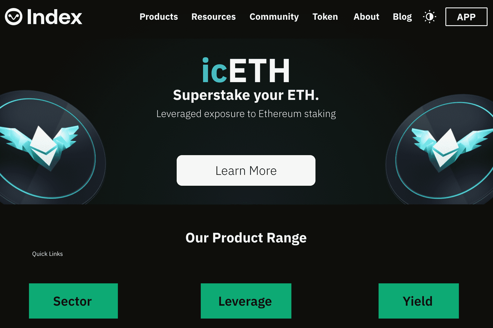

# Index Coop

Index Cooperative（“Index Coop”）是一个去中心化的自治组织（DAO），它创建和维护结构化的 DeFi 产品。这些产品基于代币化策略，为不同的加密货币和 DeFi 主题提供多样化的敞口。所有指数产品始终完全抵押并可随时赎回标的资产。
Index Coop 提供一整套行业指数产品、杠杆和反向产品以及产生收益的产品。这些指数提供了对数字资产的被动敞口，使其成为散户和机构投资者的潜在工具。例如，它们包括 DeFi 脉冲指数 (DPI)、元界指数 (MVI)、以太坊灵活杠杆指数 (ETH2x-FLI)、复利 ETH 指数 (icETH) 等。
INDEX 是建立在以太坊上的 ERC-20 治理代币。作为 DAO 参与者，INDEX 持有者可以对 Index Cooperative 生态系统内的各种决策进行投票，包括费用、新产品、团队组成和资金管理。 INDEX 还允许用户 a) 随意铸造和兑换产品，b) 提供有关指数组成的输入，以及 c) 洞察不同产品的组成。

