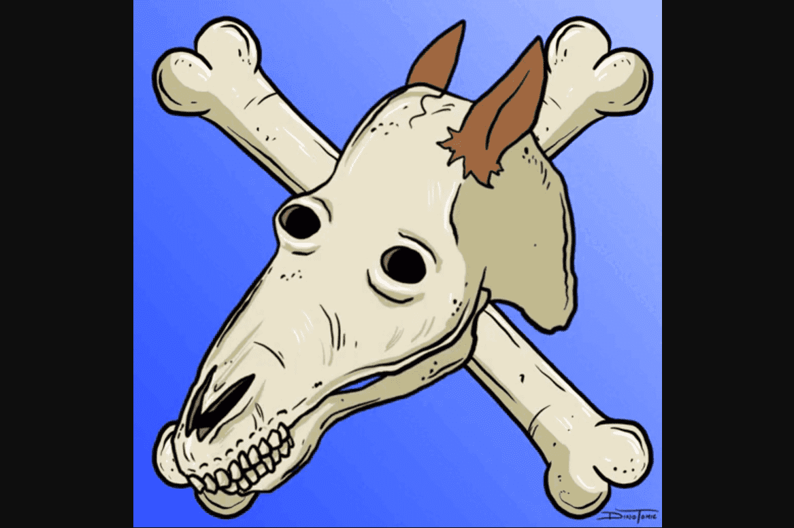

# INFAMOUSSKULLZ

10,000 个骷髅头随机生成，作为这个星球上有史以来最大的卡通片的独特艺术作品，现在您有机会拥有一个对您的头骨 NFT 具有完全商业权利的作品。这些经典和传奇的主要卡通片中的许多可能已经成名但他们的骷髅的遗骸将永远存在于区块链中。加入我们的社区，赢取赠品、获得特权和独家持有者访问未来的掉落、独家商品以及我们的游戏，您将有机会升级您的 NFT并赢得大奖。
什么是区块链技术？是一种高级数据库机制，允许在企业网络中透明地共享信息。 区块链数据库将数据存储在区块中，而数据库则一起链接到一个链条中。 数据在时间上是一致的，因为在没有网络共识的情况下，您不能删除或修改链条。 因此，您可以使用区块链技术创建不可改变的分类账，以便跟踪订单、付款、账户和其他交易。

