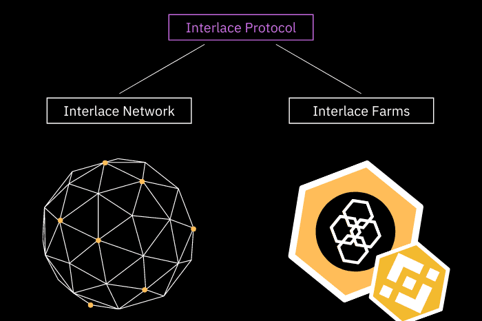

# Interlace Network

隔行扫描协议是一种基于BSC网络的分散式隐私解决方案，通过加密其数据和交易来帮助用户保持匿名。
隔行扫描网络打破了发件人和收件人地址之间的链上链接，确保了每笔交易的隐私。隔行扫描网络通过交错同一基础的各种存款货币来实现完全匿名交易。

它准备使用一个安全的智能合约，并在平衡计分卡测试网上进行测试。用户将体验到完全匿名。隔行扫描网络是当今分散式金融世界所需终极工具。

