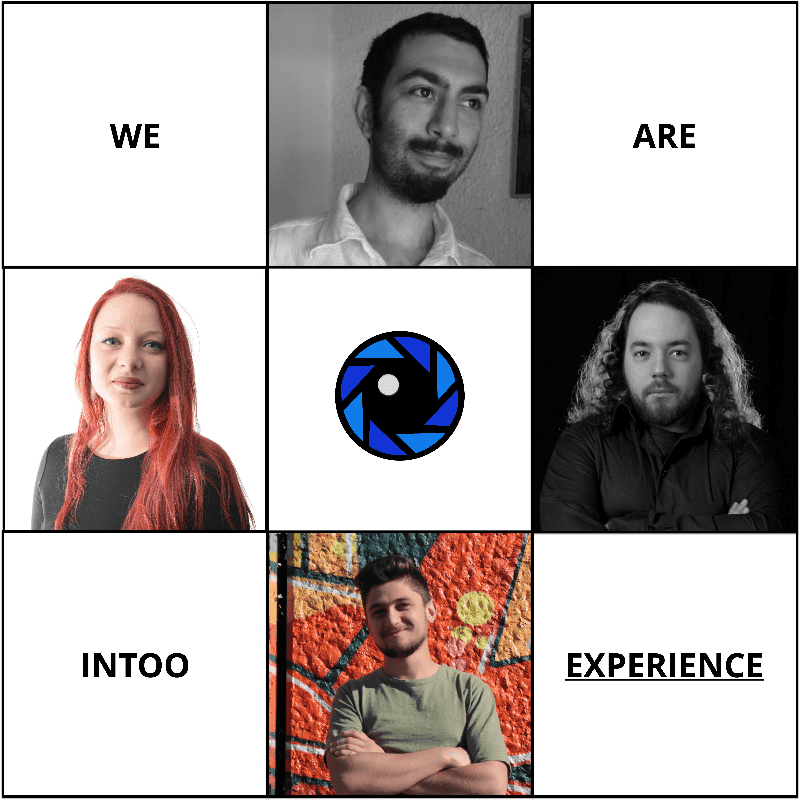

# Intoo TV

价值观和USP：
Intoo TV是一个P2P直播平台，用于设计，共享和货币化现实生活中的体验。

1. 严格一对一播出
2. 完全可定制的现场体验
3.简单，有趣：就像在多米诺定制披萨一样。
我们在设计产品时考虑了现实世界的采用，在发布时，它将成为区块链生态系统中首批功能性的最终消费者移动dApp之一。
它是如何运作的
1. 客人：
Intoo TV使每个人都可以轻松“设计”直播体验 - 他们希望以第一人称体验。允许他们设置描述，持续时间，预算，甚至日期。这样，基本上每个人都可以成为别人现实生活中的“嘉宾”，在广播时过着未经过滤的体验。
2. 主持人：
另一方面 - 表演者，有影响力的人或只是普通人可以“浏览”开放体验，并与他们“匹配”，就像他们对Tinder约会所做的那样！基于他们的兴趣和技能。
这样，他们就是别人的“主人”，通过他们的眼睛向他们展示世界。

​	3.日期和门票：
在客人和体验者就体验发生的时间和日期达成一致后，
他们都将获得一张NFT票 - 通过可验证的随机函数生成唯一的QR码 - 并使用该票在约定的日期和持续时间内加入活动。
Intoo TV让您随时随地。
通过别人的眼睛访问世界。

